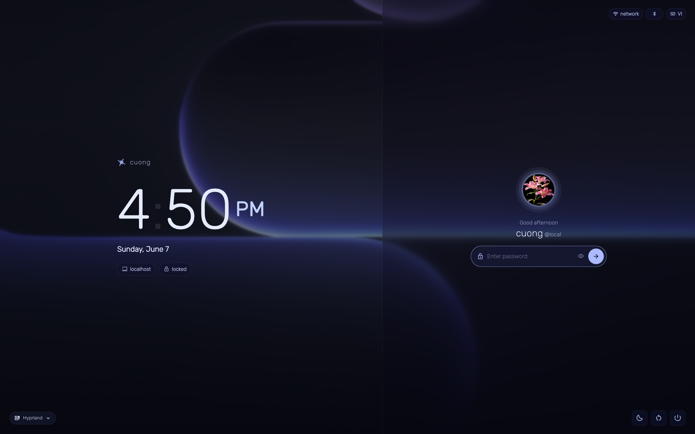
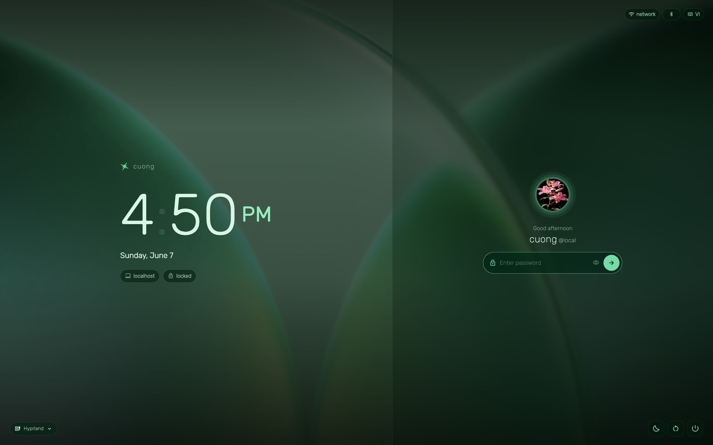
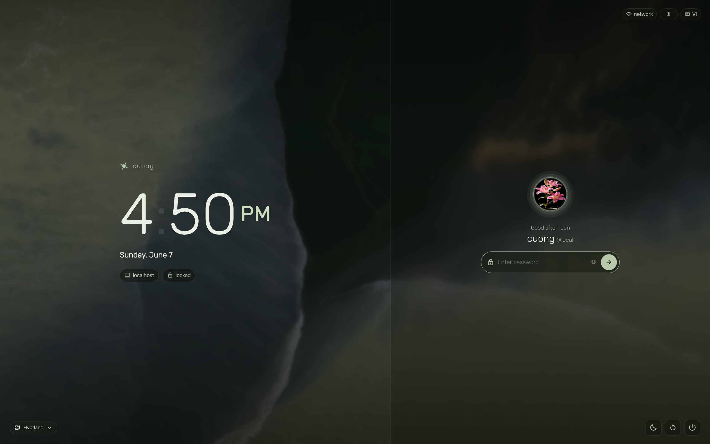
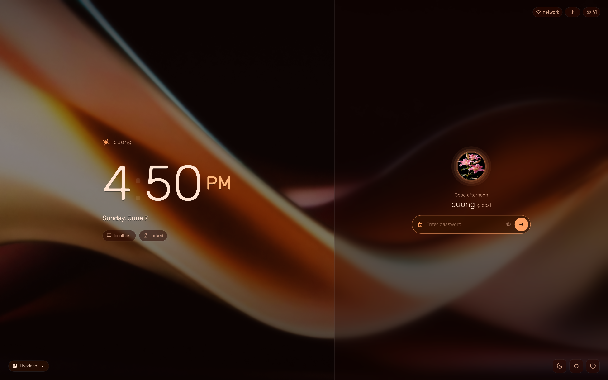

# lumina-sddm

An adaptive SDDM login theme for Hyprland + Wayland. Automatically extracts colors from your wallpaper and generates a matching palette using the Oklch color space — so every time your wallpaper changes, your login screen changes with it.

## Previews

| | |
|---|---|
|  |  |
|  |  |

## Features

- Wallpaper-synced color palette via Oklch color extraction
- Frosted glass split layout
- Live clock with AM/PM, battery indicator, hostname pills
- Smooth animated avatar with glow ring
- Session picker + power confirm overlay
- Bundled fonts — no system font dependency (Rubik + Material Symbols Rounded)
- Works with Caelestia shell wallpaper sync

## Requirements

- SDDM with Wayland support
- Hyprland (used as greeter compositor)
- Fedora / systemd-based distro

## Installation

```bash
# Copy theme
sudo cp -r lumina-sddm /usr/share/sddm/themes/

# Install fonts
sudo mkdir -p /usr/share/fonts/lumina-sddm
sudo cp assets/fonts/* /usr/share/fonts/lumina-sddm/
sudo fc-cache -fv

# Create wallpaper cache dir
sudo mkdir -p /var/cache/lumina-sddm
sudo chown sddm:sddm /var/cache/lumina-sddm

# Install wallpaper preseed service
sudo cp lumina-wallpaper-preseed.service /etc/systemd/system/
sudo systemctl enable lumina-wallpaper-preseed.service
```

## SDDM Config

`/etc/sddm.conf.d/10-lumina.conf`:

```ini
[General]
GreeterEnvironment=QML_XHR_ALLOW_FILE_READ=1,XCURSOR_THEME=Adwaita,XCURSOR_SIZE=24

[Theme]
Current=lumina-sddm
CursorTheme=Adwaita
CursorSize=24

[Wayland]
CompositorCommand=/usr/local/bin/start-hyprland -- --config /etc/hypr/sddm-greeter.conf
CursorTheme=Adwaita
CursorSize=24
```

## Hyprland Greeter Config

`/etc/hypr/sddm-greeter.conf`:

```ini
monitor = ,preferred,auto,1

env = XCURSOR_THEME,Adwaita
env = XCURSOR_SIZE,24

input {
    touchpad {
        tap-to-click = true
        natural_scroll = true
    }
    follow_mouse = 1
}

animations {
    enabled = false
}

misc {
    disable_splash_rendering = true
    disable_hyprland_logo = true
    force_default_wallpaper = 0
    disable_hyprland_guiutils_check = true
}
```

## Wallpaper Sync

Syncs automatically with Caelestia shell on wallpaper change:

```bash
systemctl --user enable --now lumina-wallpaper-sync.path
```

Or manually:

```bash
sudo bash sync-wallpaper.sh /path/to/wallpaper.jpg
```

## License

MIT
